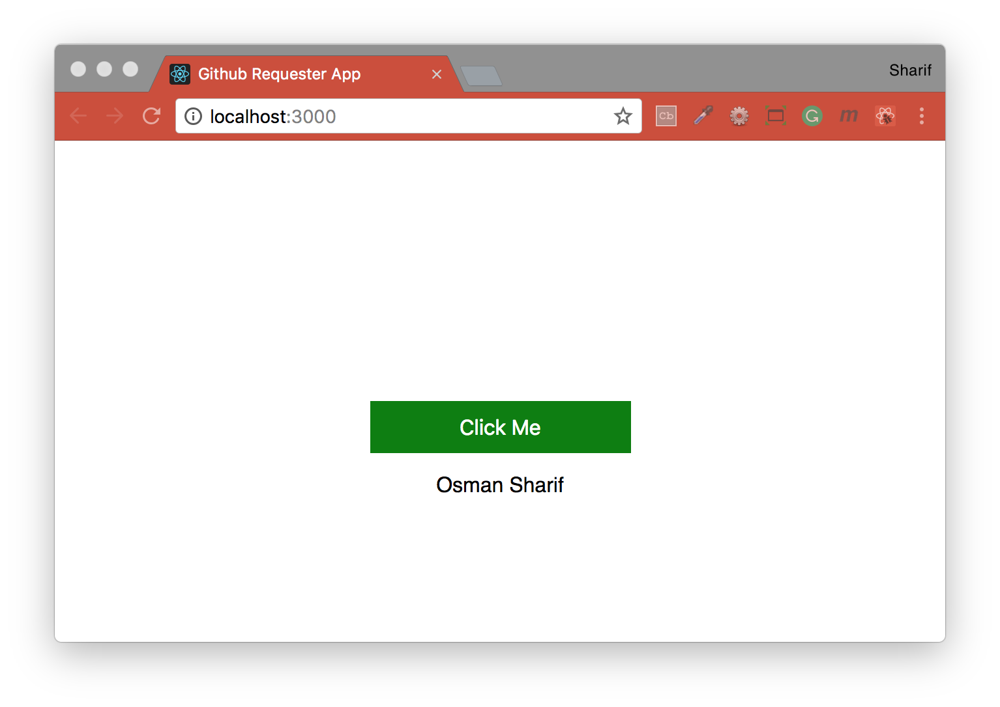
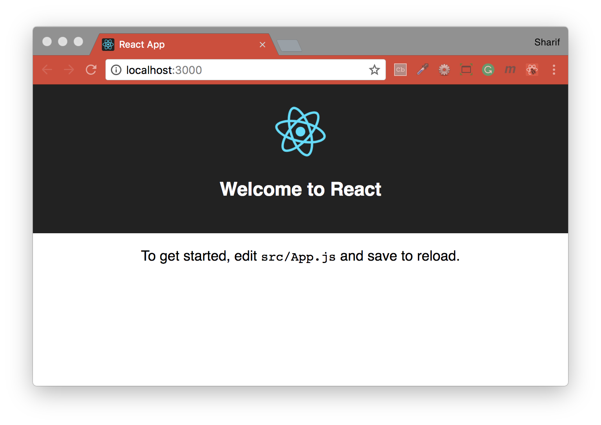
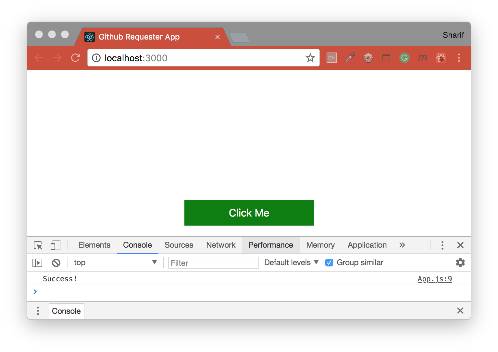
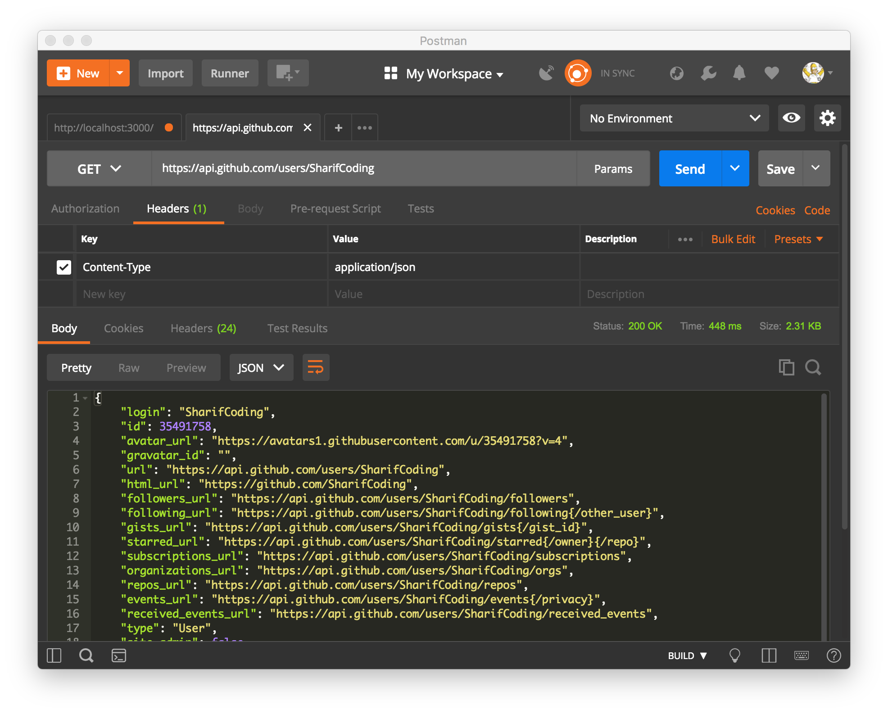

## Github Requester App - Bootstrap React Project
Making a make HTTP requests in React; going to be covering React, a popular front-end framework for building user interfaces, and axios, to make HTTP requests. Following tutorial '[How to make HTTP requests in React](https://hackernoon.com/tutorial-how-to-make-http-requests-in-react-part-1-f7afa3cd0cc8)'.

How this application works:
- User clicks a button. Button has an onClick event on it.
- onClick event triggers the handleClick function.
- handleClick function makes a request to the Github API, asking for user data for the username sent to it.
- handleClick waits for data to come back from Github using a Promise.
- handleClick updates the username attribute on state with the name returned from the Github API.
- paragraph tag displays whatever this.state.username is. When the button has not been clicked, it will return an empty string, but once the button has been clicked and the request has been completed, it will show the user’s name.



#### Built with
* [npm](https://www.npmjs.com/) - Node Package Manager
* [React](https://www.npmjs.com/package/react) - An npm package to get you immediate access to React
* [React DOM](https://www.npmjs.com/package/react-dom) - This package serves as the entry point of the DOM-related rendering paths
* [axios](https://github.com/axios/axios) - Promise based HTTP client for the browser and node.js

---
#### Installation
To run this project you will need to download it onto your local machine and install all dependencies.
Navigate inside the folder and install all dependencies by entering the following command on your terminal window:
```
npm install
```
Finally to run the server enter the following command in your terminal window:
```
npm start
```
This will run the server, open [http://localhost:3000](http://localhost:3000) to view it in the browser. If you make any changes and save the changes process will automatically refresh and you will be able to see the results in the browser.

If you want to end the process hold `control` and press `c` in mac, if you are not using mac hold `ctrl` and press `c`.

### How to make HTTP requests in React, [Part 1](https://hackernoon.com/tutorial-how-to-make-http-requests-in-react-part-1-f7afa3cd0cc8):
Step 1: Set up a new application
```bash
create-react-app github-requester
```
Step 2: Start your server
```bash
npm start
```


### How to make HTTP requests in React, [Part 2](https://hackernoon.com/tutorial-how-to-make-http-requests-in-react-part-2-4cfdba3ec65):
Step 1: Remove create-react-app boilerplate
```js
// App.js
import React, { Component } from 'react'
import './App.css'
class App extends Component {
  render () {
    return (
      <div className='button__container'>
        <button className='button'>Click Me</button>
      </div>
    )
  }
}
export default App
```
```css
/* App.css */
.button__container {
  margin-top: 200px;
  text-align: center;
}
.button {
  background-color:green;
  border: none;
  color: white;
  font-size: 16px;
  height: 40px;
  width: 200px;
}
```
Step 2: Wire up the handleClick function
```js
// App.js
import React, { Component } from 'react'
import './App.css'
class App extends Component {
  constructor () {
    super()
    this.handleClick = this.handleClick.bind(this)
  }
  handleClick () {
    console.log('Success!')
  }
  render () {
    return (
      <div className='button__container'>
        <button className='button' onClick={this.handleClick}>
          Click Me
        </button>
      </div>
    )
  }
}
export default App
```


### How to make HTTP requests in React, [Part 3](https://hackernoon.com/tutorial-how-to-make-http-requests-in-react-part-3-daa6b31b66be):
Step 1: Install axios
```bash
npm install axios -S
```
Step 2: Write a get request
```js
// App.js
import React, { Component } from 'react'
import './App.css'

import axios from 'axios'

class App extends Component {
  constructor () {
    super()
    this.state = {
      username: ''
    }

    this.handleClick = this.handleClick.bind(this)
  }

  handleClick () {
    axios.get('https://api.github.com/users/maecapozzi')
      .then(response => this.setState({username: response.data.name}))
  }

  render () {
    return (
      <div className='button__container'>
        <button className='button' onClick={this.handleClick}>Click Me</button>
        <p>{this.state.username}</p>
      </div>
    )
  }
}
export default App
```

